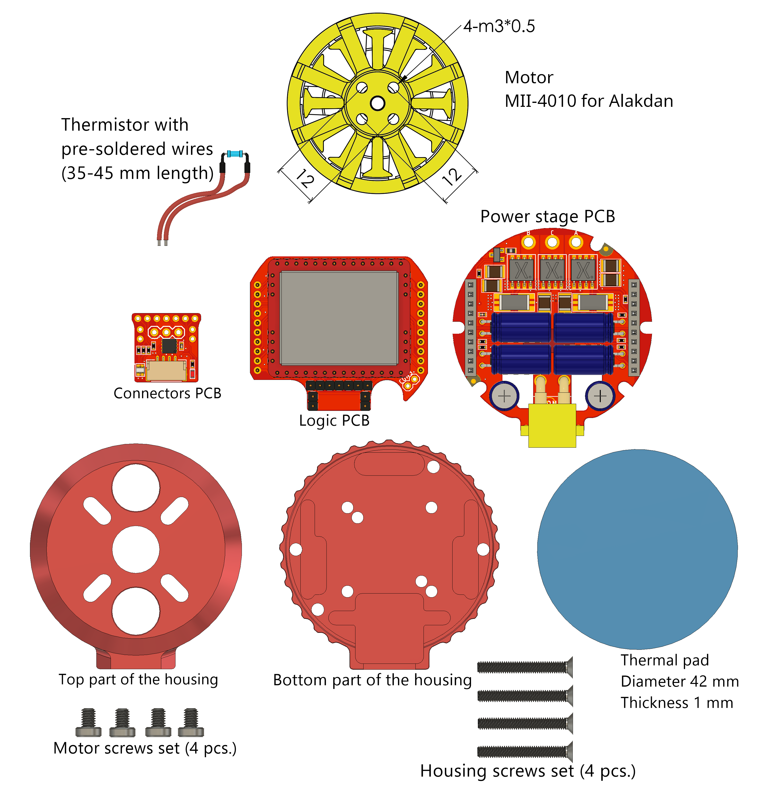

# Zubax Sadulli V1.5 manufacturing instructions

Prior to starting the assembly make sure that all the items from the list below are present.

Item                          | Amount| Part number                                                            | Description
------------------------------|-------|------------------------------------------------------------------------|-------------------------------------------------------
Motor                         | 1     | Scorpion MII-4010                                                      | BLDC motor for Alakdan.
Housing top                   | 1     |                                                                        | Milled from aluminum.
Housing bottom                | 1     |                                                                        | Milled from aluminum.
Housing screw                 | 4     | DIN 965 20 mm / M2.5x16                                                | Fastening both parts of the housing together.
Motor screw                   | 4     | DIN 7984 4 mm / M3x4                                                   | Fastening the motor to the top part of the housing.
Thermal pad                   | Dia 42 mm | Arctic Cooling ACTPD00018A, ACTPD00005A, or ACTPD00002A            | Sinks the heat to the bottom part of the housing.
Connectors PCB                | 1     |                                                                        |
Logic PCB                     | 1     |                                                                        |
Power stage PCB               | 1     |                                                                        |
Thermistor                    | 1     | NXP KTY81/120, NXP KTY81/110, NXP KTY81/121, NXP KTY81/122, NXP KTY81/150, Littelfuse 102PS1J, or Littelfuse 102PS1G | PTC thermistor with pre-soldered extension wires.

### Assembly Instructions

The whole assembly process may be divided in several sequential steps:

1. Connector and Power stage PCB SMD assembly.

2. Logic PCB assembly. This is manual operation that needs to be precise. 
    * 2 mm male pin headers need to be placed in a repeatable way on the PCB as this may affect assemblability of the device. 
Solder the shorter side to the board ensuring that the headers are straight and at a right andle to the PCB. 
To simplify the process, solder 1 pin first then adjust the angle before soldering the rest. 
    * Attach Mitochondrik LV to the Logic PCB via 2 mm pin headers.
    * Attach Connector PCB to Logic PCB via 2 mm pin headers.
    * Attach the Power stage PCB to Logic PCB via 2 mm pin headers.
    * Refer to the images below for the proper placement.

 

3. Motor modification. 
    * Remove the motor stopper.
    * The phase wires should be rerouted straight down.

4. Thermistor preparation. See photos below for reference.
    * Mix both parts of the epoxy resin in a plastic container using a wooden or plastic mixing tool.
    * Dip the thermistor into the mixture. Only a small amount of glue is needed.
    * The thermistor should be glued directly to the motor windings with epoxy resin
(care must be taken to avoid ingress of epoxy into the motor bearing). Wipe excess with tissue.
    * It can also be placed in between 2 coils, directly on top of a coil, 
or if the coils are flat - glue the side of the thermistor with the flat silver plate.
    * It may be necessary to add more resin to both sides of the thermistor. 
Use a cotton bud to apply more glue carefully.
    * Wait for the epoxy resin to solidify - around 5 minutes.
    * Trim the leads of the thermistor to 2-3 mm.
    * Get 2 pieces of thin wires (0.3-0.6 mm dia). The wires' length should be ~35-45 mm. Remove a portion of the outer casing.
    * Add solder to the ends of the wires (3-5 mm). Add solder to the thermistor leads. 
    * Solder the wire to the lead side-by-side to ensure sufficient contact between the two.
    * Get 2 pieces of the smallest heat shrink tube. Cut to 2-3 mm in length. Cover the connection point and apply heat with a heat gun.

 
 
 

5. Housing Attachment. See photos for reference.
    * Insert the motor phase wires and the thermistor wires through the housing holes. Ensure proper placement.
    * Get 4 pieces of DIN 7984 4 mm (motor screws). Attach the motor to the top housing. Use threadlock. 
Ensure that the screws don't touch the coils and that no moving part of the motor is touching the enclosure.
    * Trim the motor phase wires to ~30-35 mm (measuring from the bottom of the motor).
    * Remove the insulation. Twist the wires. Add solder to the ends of each wire (3-5 mm).
    * Place the assembly on a vise to secure it. Use rubber protection pads so that the motor isn't scratched.
    * Solder the phase wires to 3 pads on the PCB.
    * **The phase wires shall be soldered such that a positive setpoint drives the motor clockwise (viewed from the top).**
If the observed direction is different, any two phase wires of the three are to be swapped.
    * Trim the thermistor wires and solder to 2 pads on the PCB. See photo for correct placement.
    * Add thermal pad to the inside of the bottom housing. 
    * The thermal pad has the shape of a circle with a diameter of 40-42 mm, 1 mm thickness.
    * Attach bottom housing to the top housing using 4 housing screws (DIN 965 20 mm / M2.5x16)

 
 
 

6. Test using DrWatson (internal).
    * **If the motor spins counterclockwise (viewed from the top) during the DrWatson test, remove the bottom housing and swap any two phase wires.**

For the detailed assembly process of Sadulli v1.0 (Grosso/Piccino) please check the video: https://youtu.be/bqTBei1wUUw
